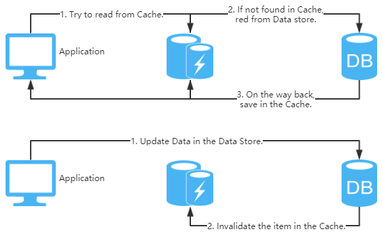

[转载自酷壳个人博客：[缓存更新的套路](https://coolshell.cn/articles/17416.html/comment-page-2#comment-1926168)]

看到好些人在写更新缓存数据代码时，**先删除缓存，然后再更新数据库**，而后续的操作会把数据再装载的缓存中。**然而，这个是逻辑是错误的。**试想，两个并发操作，一个是更新操作，另一个是查询操作，更新操作删除缓存后，查询操作没有命中缓存，先把老数据读出来后放到缓存中，然后更新操作更新了数据库。于是，在缓存中的数据还是老的数据，导致缓存中的数据是脏的，而且还一直这样脏下去了。

我不知道为什么这么多人用的都是这个逻辑，当我在微博上发了这个贴以后，我发现好些人给了好多非常复杂和诡异的方案，所以，我想写这篇文章说一下几个缓存更新的Design Pattern（让我们多一些套路吧）。

这里，我们先不讨论更新缓存和更新数据这两个事是一个事务的事，或是会有失败的可能，我们先假设更新数据库和更新缓存都可以成功的情况（我们先把成功的代码逻辑先写对）。

更新缓存的的Design Pattern有四种：Cache aside, Read through, Write through, Write behind caching，我们下面一一来看一下这四种Pattern。

> **Cache Aside Pattern**

这是最常用最常用的pattern了。其具体逻辑如下：

* **失效**：应用程序先从cache取数据，没有得到，则从数据库中取数据，成功后，放到缓存中。
* **命中**：应用程序从cache中取数据，取到后返回。
* **更新**：先把数据存到数据库中，成功后，再让缓存失效。

注意，我们的更新是先更新数据库，成功后，让缓存失效。那么，这种方式是否可以没有文章前面提到过的那个问题呢？我们可以脑补一下。

一个是查询操作，一个是更新操作的并发，首先，没有了删除cache数据的操作了，而是先更新了数据库中的数据，此时，缓存依然有效，所以，并发的查询操作拿的是没有更新的数据，但是，更新操作马上让缓存的失效了，后续的查询操作再把数据从数据库中拉出来。而不会像文章开头的那个逻辑产生的问题，后续的查询操作一直都在取老的数据。

这是标准的design pattern，包括Facebook的论文《[Scaling Memcache at Facebook](https://www.usenix.org/system/files/conference/nsdi13/nsdi13-final170_update.pdf)》也使用了这个策略。为什么不是写完数据库后更新缓存？你可以看一下Quora上的这个问答《[Why does Facebook use delete to remove the key-value pair in Memcached instead of updating the Memcached during write request to the backend?](https://coolshell.cn/articles/17416.html/comment-page-2#comment-1926168)》，主要是怕两个并发的写操作导致脏数据。

> **Read/Write Through Pattern**
**