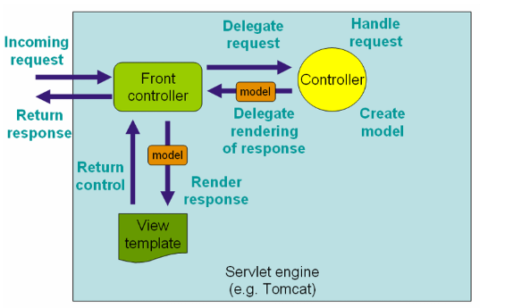

# 过滤器

* Servlet中的过滤器Filter是实现了javax.servlet.Filter接口的服务器端程序。

# 监听器

* Servlet的监听器Listener是实现了javax.servlet.ServletContextListener接口的服务器端程序。

# 拦截器

* SpringMVC的拦截器Interceptor是实现了org.springframework.web.servlet.HandlerInterceptor接口的服务器端程序。
* 使用代理的方式实现


在使用SpringMVC拦截器的时候，我们接触的最多的便是HandlerInterceptor接口，因为我们所有的自定义拦截器都必须要实现HandlerInterceptor接口，那么就先从HandlerInterceptor接口开始一步步分析。

## HandlerInterceptor接口

包含三个方法：

```java
package org.springframework.web.servlet;

import javax.servlet.http.HttpServletRequest;
import javax.servlet.http.HttpServletResponse;

public interface HandlerInterceptor {
    boolean preHandle(HttpServletRequest var1, HttpServletResponse var2, Object var3) throws Exception;

    void postHandle(HttpServletRequest var1, HttpServletResponse var2, Object var3, ModelAndView var4) throws Exception;

    void afterCompletion(HttpServletRequest var1, HttpServletResponse var2, Object var3, Exception var4) throws Exception;
}
```


一个访问请求到达前端控制器，请求控制器得到业务数据，返还给前端控制器，前端控制器再把业务数据分发给业务视图，视图来呈现业务页面返还给前端控制器，前端控制器再呈现给浏览器。

> MVC的核心思想是业务数据抽取和业务数据呈现相分离。

**MVC架构模式**

MVC是一种使用模型-视图-控制器设计创建Web应用程序的模式：
* Model（模型）表示应用程序核心（比如数据库记录列表）
* View（视图）显示数据（数据库记录）
* Controller（控制器）处理输入（写入数据库记录）

**SpringMVC基本概念**

* DispatherServlet：SpringMVC中的DispatherServlet就是前端控制器的实现。请求通过Cotroller提交给DispatherServlet，再分发给Model和View层，实现业务的传递。
* Controller：Cotroller根据提交的请求完成对Model的生成。


## 资料

* [SpringMVC拦截器](https://zhum.in/blog/frame/SpringMVC/SpringMVC%E6%8B%A6%E6%88%AA%E5%99%A8/)
* [springMVC(1) 拦截器的实现原理](https://www.jianshu.com/p/36e60d72e176)