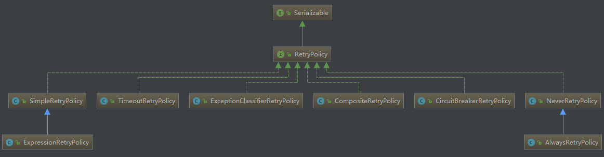
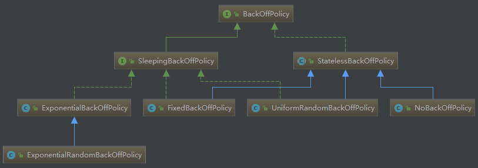

# 重试框架SpringRetry

## 基本概念

spring-retry项目实现了重试和熔断功能，目前已用于SpringBatch、Spring Integration等项目。其整体思路大致如下图所示：


* RetryTemplate：重试模板，是进入spring-retry框架的整体流程入口;
* RetryCallback：重试回调，用户包装业务流，第一次执行和产生重试执行都会调用这个callback代码；
* RetryPolicy：重试策略，不同策略有不同的重试方式；
* BackOffPolicy：两次重试之间的退避策略，一般采用超时时间机制；
* RecoveryCallback：当所有重试都失败后，回调该接口，提供给业务重试回复机制；
* RetryContext：每次重试都会将其作为参数传入RetryCallback中使用；
* RetryListener：监听重试行为，主要用于监控。

当RetryCallback的调用产生异常的时候，框架首先会通过我们设置的RetryPolicy判断本次异常是否需要重试，如果需要重试，则调用BackOffPolicy，回退一定时间后，在重新调用RetryCallback。如果所有重试都失败了，则退出重试，调用RecoveryCallback退出服务。


> 本文源码版本为：spring-retry:1.2.2.RELEASE

RetryOperations定义了重试的API，RetryTemplate提供了模板实现，线程安全的，同于Spring一贯的API风格，RetryTemplate将重试、熔断功能封装到模板中，提供健壮和不易出错的API供大家使用。

首先，RetryOperations接口API：

```java
package org.springframework.retry;

public interface RetryOperations {
    <T, E extends Throwable> T execute(RetryCallback<T, E> var1) throws E;

    <T, E extends Throwable> T execute(RetryCallback<T, E> var1, RecoveryCallback<T> var2) throws E;

    <T, E extends Throwable> T execute(RetryCallback<T, E> var1, RetryState var2) throws E, ExhaustedRetryException;

    <T, E extends Throwable> T execute(RetryCallback<T, E> var1, RecoveryCallback<T> var2, RetryState var3) throws E;
}
```
解释一下各个参数：
* RetryCallback：定义需重试的业务服务;
* RecoveryCallback：当重试超过最大重试时间或最大重试次数后可以调用 RecoveryCallback 进行恢复；
* RetryState：定义有状态重试。

那什么时候需重试？spring-retry是当抛出相关异常后执行重试策略，定义重试策略时需要定义需要重试的异常（如因远程调用失败的可以重试、而因入参校对失败不应该重试）。只读操作可以重试，幂等写操作可以重试，但是非幂等写操作不能重试，重试可能导致脏写，或产生重复数据。


重试策略有哪些呢？



RetryPolicy提供了如下策略实现：
* SimpleRetryPolicy：固定次数重试策略，默认重试最大次数为3次，RetryTemplate默认使用的策略；
* ExpressionRetryPolicy：使用表达式匹配重试策略。
* TimeoutRetryPolicy：超时时间重试策略，默认超时时间为1秒，在指定的超时时间内允许重试；
* ExceptionClassifierRetryPolicy：设置不同异常的重试策略，类似组合重试策略，区别在于这里只区分不同异常的重试；
* CompositeRetryPolicy：组合重试策略，将不同的策略组合起来，有两种组合方式，乐观组合重试策略是指顺序遍历配置的组合策略如果有一个策略允许重试就可以重试，悲观组合重试策略则只要有一个策略不允许重试就不可以重试。
* CircuitBreakerRetryPolicy：有熔断功能的重试策略，需设置3个参数openTimeout、resetTimeout和delegate，稍后详细介绍该策略；
* NeverRetryPolicy：只允许调用RetryCallback一次，不允许重试；
* AlwaysRetryPolicy：允许无限重试，直到成功，此方式逻辑不当会导致死循环。

重试时的退避策略是什么？是立即重试还是等待一段时间后重试，比如是网络错误，立即重试将导致立即失败，最好等待一小段时间后重试，还要防止很多服务同时重试导致DDos。



BackOffPolicy提供了如下策略实现：
* ExponentialBackOffPolicy：指数退避策略，需设置参数sleeper、initialInterval、maxInterval和multiplier，initialInterval指定初始休眠时间，默认100毫秒，maxInterval指定最大休眠时间，默认30秒，multiplier指定乘数，即下一次休眠时间为当前休眠时间*multiplier；
* ExponentialRandomBackOffPolicy：随机指数退避策略，引入随机乘数，之前说过固定乘数可能会引起很多服务同时重试导致DDos，使用随机休眠时间来避免这种情况。
* FixedBackOffPolicy：固定时间的退避策略，需设置参数sleeper和backOffPeriod，sleeper指定等待策略，默认是Thread.sleep，即线程休眠，backOffPeriod指定休眠时间，默认1秒；
* UniformRandomBackOffPolicy：随机时间退避策略，需设置sleeper、minBackOffPeriod和maxBackOffPeriod，该策略在[minBackOffPeriod,maxBackOffPeriod]之间取一个随机休眠时间，minBackOffPeriod默认500毫秒，maxBackOffPeriod默认1500毫秒；
* NoBackOffPolicy：无退避算法策略，即当重试时是立即重试。

## 源码实现

接下来先看下RetryTemplate主要流程实现：

```java
protected <T, E extends Throwable> T doExecute(RetryCallback<T, E> retryCallback,RecoveryCallback<T> recoveryCallback, RetryState state) throws E, ExhaustedRetryException {
   //重试策略
   RetryPolicy retryPolicy = this.retryPolicy;
   //退避策略
   BackOffPolicy backOffPolicy = this.backOffPolicy;
   //重试上下文，当前重试次数等都记录在上下文中
   RetryContext context = open(retryPolicy, state);
   try {
      //拦截器模式，执行RetryListener#open
      boolean running = doOpenInterceptors(retryCallback, context);
      //判断是否可以重试执行
      while (canRetry(retryPolicy, context) && !context.isExhaustedOnly()) {
         try {//执行RetryCallback回调
            return retryCallback.doWithRetry(context);
         } catch (Throwable e) {//异常时，要进行下一次重试准备
            //遇到异常后，注册该异常的失败次数
            registerThrowable(retryPolicy, state, context, e);
            //执行RetryListener#onError
            doOnErrorInterceptors(retryCallback, context, e);
            //如果可以重试，执行退避算法，比如休眠一小段时间后再重试
            if (canRetry(retryPolicy, context) && !context.isExhaustedOnly()) {
               backOffPolicy.backOff(backOffContext);
            }
            //state != null && state.rollbackFor(context.getLastThrowable())
            //在有状态重试时，如果是需要执行回滚操作的异常，则立即抛出异常
            if (shouldRethrow(retryPolicy, context, state)) {
               throw RetryTemplate.<E>wrapIfNecessary(e);
            }
         }
         //如果是有状态重试，且有GLOBAL_STATE属性，则立即跳出重试终止；当抛出的异常是非需要执行回滚操作的异常时，才会执行到此处，CircuitBreakerRetryPolicy会在此跳出循环；
         if (state != null && context.hasAttribute(GLOBAL_STATE)) {
            break;
         }
      }
      //重试失败后，如果有RecoveryCallback，则执行此回调，否则抛出异常
      return handleRetryExhausted(recoveryCallback, context, state);
   } catch (Throwable e) {
      throw RetryTemplate.<E>wrapIfNecessary(e);
   } finally {
      //清理环境
      close(retryPolicy, context, state, lastException == null || exhausted);
      //执行RetryListener#close，比如统计重试信息
      doCloseInterceptors(retryCallback, context, lastException);
   }
}
```

## 有状态or无状态

**对于无状态重试，这意味着产生异常，并不会将其抛出去，对于事务性调用，这是不可容忍的，因为上层框架需要获得异常进行事务的回滚操作，此时应当使用有状态重试。**

## 参考资料
* [srping-try github](https://github.com/spring-projects/spring-retry)
* [spring-retry重试与熔断详解—《亿级流量》内容补充](https://yq.aliyun.com/articles/92899)
* [利用Spring-Retry定制化你的RPC重试](http://kriszhang.com/spring-retry/)

#

———— ☆☆☆ —— 返回 -> [spring](./index.md) <- 目录 —— ☆☆☆ ————