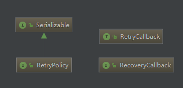

# 重试框架SpringRetry

spring retry 主要实现了**重试**和**熔断**。



`RetryOperations` 定义了重试的 API，`RetryTemplate` 提供了模板实现，线程安全的，同于 Spring 一贯的 API 风格，`RetryTemplate` 将重试、熔断功能封装到模板中，提供健壮和不易出错的API供大家使用。

首先，`RetryOperations` 接口 API：

```java
package org.springframework.retry;

public interface RetryOperations {
    <T, E extends Throwable> T execute(RetryCallback<T, E> var1) throws E;

    <T, E extends Throwable> T execute(RetryCallback<T, E> var1, RecoveryCallback<T> var2) throws E;

    <T, E extends Throwable> T execute(RetryCallback<T, E> var1, RetryState var2) throws E, ExhaustedRetryException;

    <T, E extends Throwable> T execute(RetryCallback<T, E> var1, RecoveryCallback<T> var2, RetryState var3) throws E;
}
```
解释一下各个参数：
* `RetryCallback`：定义需重试的业务服务;
* `RecoveryCallback`：当重试超过最大重试时间或最大重试次数后可以调用 `RecoveryCallback` 进行恢复；
* `RetryState`：定义有状态重试。

那什么时候需重试？spring-retry 是当抛出相关异常后执行重试策略，定义重试策略时需要定义需要重试的异常（如因远程调用失败的可以重试、而因入参校对失败不应该重试）。只读操作可以重试，幂等写操作可以重试，但是非幂等写操作不能重试，重试可能导致脏写，或产生重复数据。


