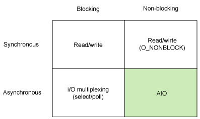
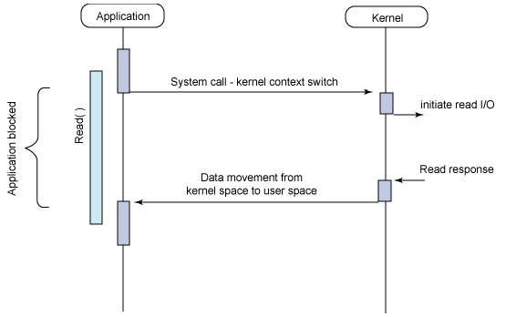
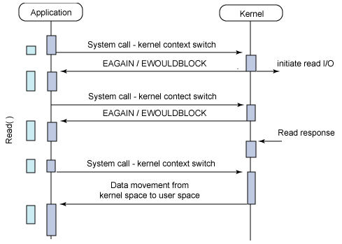

# IO-同步，异步，阻塞，非阻塞

## I/O模型

图1给出了同步和异步模型，以及阻塞和非阻塞的模型。

图 1.基本Linux I/O模型的简单矩阵

每个I/O模型都有自己的使用模式，它们对于特定的应用程序都有自己的优点。

## 同步阻塞I/O

最常用的一个模型是同步阻塞I/O模型。在这个模型中，用户空间的应用程序执行一个系统调用，这会导致应用程序阻塞。这意味着应用程序会一直阻塞，直到系统调用完成为止（数据传输完成或发生错误）。调用应用程序处于一种不再消费CPU而只是简单等待响应的状态，因此从处理的角度来看，这是非常有效的。

图2给出了传统的阻塞I/O模型，这也是目前应用程序中最为常用的一种模型。其行为非常容易理解，其用法对于典型的应用程序来说都非常有效。在调用read系统调用时，应用程序会阻塞并对内核进行上下文切换。然后会触发读操作，当响应返回时，数据就被移动到用户空间的缓冲区中。然后应用程序就会解除阻塞（read调用返回）。

图 2.同步阻塞I/O模型的典型流程

> 举一个浅显的例子，就好比你去一个银行柜台存钱。首先，你会将存钱的单子填好，然后交给柜员。这里，你就好比是application，单子就是调用的system call，柜员就是kernel。提交好单子后，你就坐在柜台前等，相当于开始进行等待。柜员办好以后会给你一个回执，表示办好了，这就是 response。然后你就可以拿着回执干其它的事了。注意，这个时候，如果你办完之后马上去查账，存的钱已经打到你的账户上了。后面你会发现，这点很重要。

## 同步非阻塞I/O

同步阻塞I/O的一种效率稍低的变种是同步非阻塞I/O。在这种模型中，设备是以非阻塞的形式打开的。这意味着I/O操作不会立即完成，read操作可能会返回一个错误代码，说明这个命令不能立即满足（EAGAIN或EWOULDBLOCK），如图3所示。

非阻塞的实现是I/O命令可能并不会立即满足，需要应用程序调用许多次来等待操作完成。这可能效率不高，因为在很多情况下，当内核执行这个命令时，应用程序必须要进行忙碌等待，直到数据可用为止，或者试图执行其他工作。正如图3所示的一样，这个方法可以引入I/O操作的延时，因为数据在内核中变为可用到用户调用read返回数据之间存在一定的间隔，这会导致整体数据吞吐量的降低。

图 3. 同步非阻塞 I/O 模型的典型流程

> 这次不是去银行存钱，而是去银行汇款。同样的，你也需要填写汇款单然后交给柜员，柜员进行一 些简单的手续处理就能够给你回执。但是，你拿到回执并不意味着钱已经打到了对方的账上。事实上，一般汇款的周期大概是24个小时，如果你要以存钱的模式来 汇款的话，意味着你需要在银行等24个小时，这显然是不现实的。所以，同步非阻塞IO在实际生活中也是有它的意义的。

## 参考资料

* [使用异步 I/O 大大提高应用程序的性能](https://www.ibm.com/developerworks/cn/linux/l-async/)