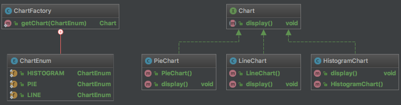

# 工厂模式

工厂模式分为三类：简单工厂模式、工厂方法模式、抽象工厂模式。

## 简单工厂模式（Simple  Factory Pattern）

简单工厂模式：定义一个工厂类，它可以根据参数的不同返回不同类的实例，被创建的实例通常都具有**共同的父类（或接口）**。因为在简单工厂模式中用于创建实例的方法是静态(static)方法，因此简单工厂模式又被称为静态工厂方法（Static Factory Method）模式，它属于类创建型模式。



```java
public class ChartFactory {
    public static Chart getChart(ChartEnum type) {
        Chart chart;
        switch (type) {
            case PEI:
                chart = new PieChart();
                System.out.println("初始化设置柱状图！");
                break;
            case LINE:
                chart = new LineChart();
                System.out.println("初始化设置折线图！");
                break;
            case HISTOGRAM:
                chart = new HistogramChart();
                System.out.println("初始化设置饼状图");
                break;
            default:
                chart = null;
        }
        return chart;
    }
}
```

**缺点：**
1. 工厂类过于庞大，包含了大量的if…else…代码，导致维护和测试难度增大；
2. 系统扩展不灵活，如果增加新类型的日志记录器，必须修改静态工厂方法的业务逻辑，违反了“开闭原则”。

## 工厂方法模式

## 抽象工厂模式

#

———— ☆☆☆ —— 返回 -> [westboy-设计模式](index.md) <- 目录 —— ☆☆☆ ————