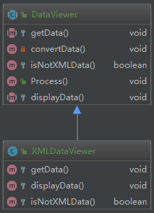
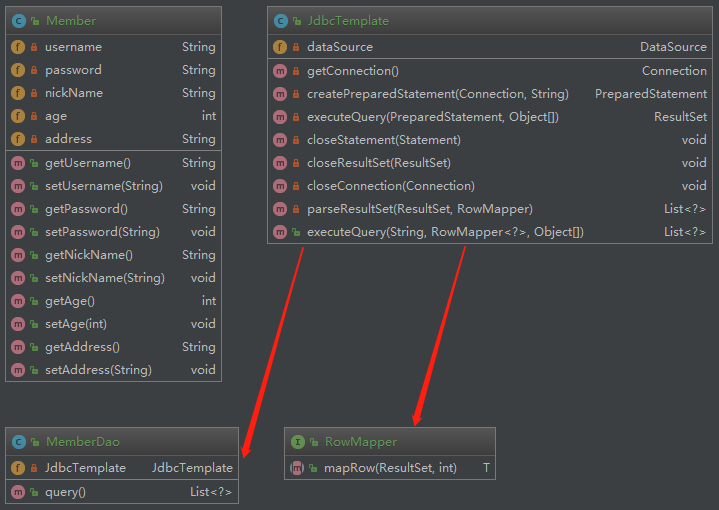

# 模板方法模式

模板方法模式：定义一个操作中算法的框架，而将一些步骤延迟到子类中。模板方法模式使得子类可以不改变一个算法的结构即可重定义该算法的某些特定步骤。

模板方法模式是一种**基于继承的代码复用技术**，它是一种类行为型模式。

## 1.模板方法

一个模板方法是定义在抽象类中的、把基本操作方法组合在一起形成一个总算法或一个总行为的方法。这个模板方法定义在抽象类中，并由子类不加以修改地完全继承下来。模板方法是一个具体方法，它给出了一个顶层逻辑框架，而逻辑的组成步骤在抽象类中可以是具体方法，也可以是抽象方法。由于模板方法是具体方法，因此模板方法模式中的抽象层只能是抽象类，而不是接口。

## 2.基本方法
 
基本方法是实现算法各个步骤的方法，是模板方法的组成部分。基本方法又可以分为三种：抽象方法(Abstract Method)、具体方法(Concrete Method)和钩子方法(Hook Method)。

* **抽象方法**：一个抽象方法由抽象类声明、由其具体子类实现。在C#语言里一个抽象方法以abstract关键字标识。
* **具体方法**：一个具体方法由一个抽象类或具体类声明并实现，其子类可以进行覆盖也可以直接继承。
* **钩子方法**：一个钩子方法由一个抽象类或具体类声明并实现，而其子类可能会加以扩展。

## 3.模板方法模式应用实例

code:[template-pattern](https://github.com/wsboy/ocean/tree/master/design-pattern/src/main/java/com/westboy/ocean/templatepattern)

## 4.钩子方法的使用

模板方法模式中，在父类中提供了一个定义算法框架的模板方法，还提供了一系列抽象方法、具体方法和钩子方法，其中**钩子方法的引入使得子类可以控制父类的行为**。

## 5.模板方法模式效果与适用场景

**模板方法模式是基于继承的代码复用技术**，它体现了面向对象的诸多重要思想，是一种使用较为频繁的模式。模板方法模式广泛应用于框架设计中，以确保通过父类来控制处理流程的逻辑顺序（如框架的初始化，测试流程的设置等）。

### 5.1.模板方法模式的主要优点

1. 在父类中形式化地定义一个算法，而由它的子类来实现细节的处理，在子类实现详细的处理算法时并不会改变算法中步骤的执行次序。
2. 模板方法模式是一种代码复用技术，它在类库设计中尤为重要，它提取了类库中的公共行为，将公共行为放在父类中，而通过其子类来实现不同的行为，它鼓励我们恰当使用继承来实现代码复用。
3. 可实现一种反向控制结构，通过子类覆盖父类的钩子方法来决定某一特定步骤是否需要执行。
4. 在模板方法模式中可以通过子类来覆盖父类的基本方法，不同的子类可以提供基本方法的不同实现，更换和增加新的子类很方便，符合单一职责原则和开闭原则。
 
### 5.2.模板方法模式的主要缺点

需要为每一个基本方法的不同实现提供一个子类，如果父类中可变的基本方法太多，将会导致类的个数增加，系统更加庞大，设计也更加抽象，此时，可结合桥接模式来进行设计。

### 5.3.模式适用场景

1. 对一些复杂的算法进行分割，将其算法中固定不变的部分设计为模板方法和父类具体方法，而一些可以改变的细节由其子类来实现。即：一次性实现一个算法的不变部分，并将可变的行为留给子类来实现。
2. 各子类中公共的行为应被提取出来并集中到一个公共父类中以避免代码重复。
3. 需要通过子类来决定父类算法中某个步骤是否执行，实现子类对父类的反向控制。

## 6.改进-模板方法模式的另一种实现方式

模板模式一般是需要继承的。 这里想要探讨另一种对模板的理解。 Spring中的JdbcTemplate， 在用这个类时并不想去继承这个类， 因为这个类的方法太多， 但是我们还是想用到JdbcTemplate已有的稳定的、 公用的数据库连接， 那么我们怎么办呢？ 我们可以把变化的东西抽出来作为一个参数传入JdbcTemplate的方法中。 但是变化的东西是一段代码， 而且这段代码会用到JdbcTemplate中的变量。 怎么办？ 那我们就用回调对象吧。 在这个回调对象中定义一个操纵JdbcTemplate中变量的方法， 我们去实现这个方法， 就把变化的东西集中到这里了。 然后我们再传入这个回调对象到JdbcTemplate， 从而完成了调用。 这就是模板模式不需要继承的另一种实现方式。

code:[jdbcTemplate-pattern](https://github.com/wsboy/ocean/tree/master/design-pattern/src/main/java/com/westboy/ocean/templatepattern/jdbctemplate)
 
#

———— ☆☆☆ —— 返回 -> [westboy-设计模式](index.md) <- 目录 —— ☆☆☆ ————