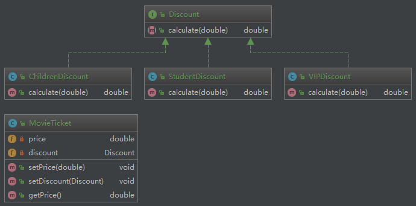

# 策略模式

策略模式：定义一系列算法类，将每一个算法封装起来，并让它们可以相互替换，策略模式让算法独立于使用它的客户而变化，也称为政策模式(Policy)。策略模式是一种对象行为型模式。

code:[strategy-pattern](https://github.com/wsboy/ocean/tree/master/design-pattern/src/main/java/com/westboy/ocean/strategypattern)

#

———— ☆☆☆ —— 返回 -> [westboy-设计模式](index.md) <- 目录 —— ☆☆☆ ————