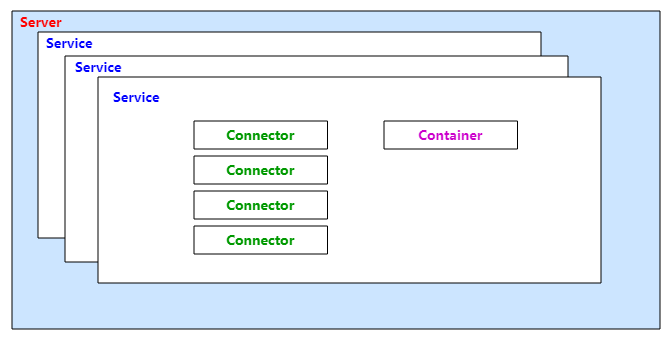

**TOC**
1. Tomcat的顶层结构
2. Tomcat的启动过程

# 1.Tomcat的顶层结构

* Tomcat最顶层的容器叫Server，代表整个服务器，一个Server中包含至少一个Service，用于提供服务。
* Service主要包含两部分：Connector和Container。
    * Connector用于处理连接相关的事情，并提供Socket与request、response的转换。
    * Container用于封装和管理Servlet，以及具体request请求。
* 一个Tomcat中只有一个Server，一个Server可以包含多个Service，一个Service只有一个Container，但可以有多个Connector（因为一个服务可以有多个连接）。

# 2.Tomcat的启动过程